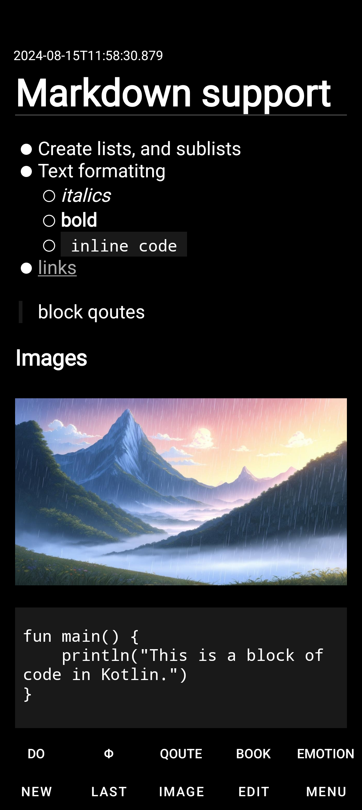
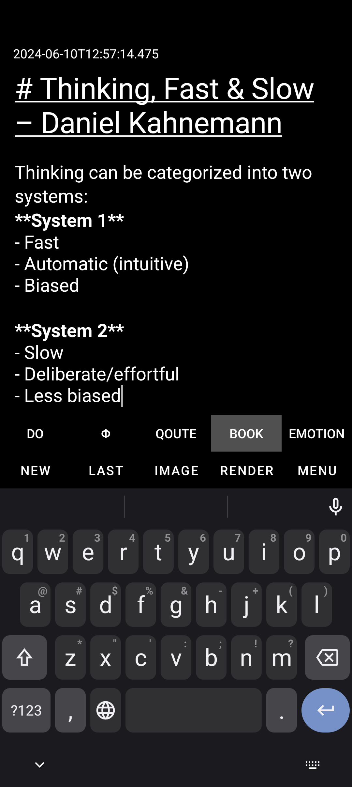
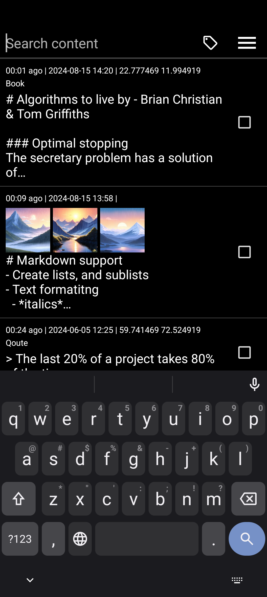
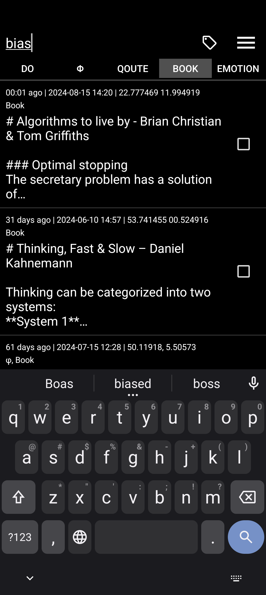

#  Journalize 

A fast-to-use android journaling app.

 
 

## Features

- Renders in Markdown (images included)
- Automatic pseudo-Markdown rendering
- Automatically generates the next starting character in lists
- Import, export, and share
- Supports geo-stamping of entries
- Custom tags for the entries
- Browse entries
- Search entries based on content and tags
- Quickly open previous entry
- Automatically open new entry after reopening app after custom duration
- Black and White mode, both in greyscale

## Usage

Journalize is built around entries, an entry is a single record containing the content you write, a timestamp, and location (if you allow it).

### Tags
Above the keyboard, there are two rows of buttons, the first one is for tags, by default it contains "Do, Philosophy, Quote, Book, Emotion", these can be changed in settings. ags help you organize entries and can be used later for searching.

### Second button row
This row contains 5 buttons:

#### New
This makes a new empty entry

#### Last
This opens the last modified entry that's not currently open

#### Image
his allows you to add images; however, you need to render the entry to view them.

#### Render/Edit
Pressing this button renders the text using Markdown.
Pressing it again lets you edit the entry.

#### Menu
This allows you to open a list of all entries. From here you can open settings by pressing on the menu in top right corner and pressing `Settings`.
You can also select entries individually or select all displayed entries by pressing `Select All Shown` in the overflow menu.

##### Searching
You can use special keywords `AND`/`∧` and `OR`/`∨`to refine your search queries. `AND`/`∧` takes precedence.
You can further refine your search by pressing the tag icon in the top-right corner and selecting the tags you want to include.

##### Settings
To update values remember to press `Done`/`Return`.
Before exporting, you need to choose a directory.
Importing will overwrite your current entries.

### Automatic Pseudo-MarkDown rendering
When typing in an entry, the text will be modified to resemble Markdown. Here are some examples:

- _\*Italics*_ or *\_Italics_*
- __\*\*Bold**__ or **\_\_Bold__**
- \`Code`

#### Titles can be made by starting lines with 1 to 6 `#`'s

Lists can be created by starting a line with one of the following methods:
1. \-
2. \*
3. \+
4. A number followed by a dot. Like this list.

When typing in a list, pressing `Return` will automatically create a new list item on the next line. If you press `Return` again while the list item is empty, the list element will be removed, and the cursor will move to a new line without continuing the list.

## Alternatives

This app is designed for journaling. While it can be used for diaries, I recommend using other apps like:
- [Diary](https://github.com/billthefarmer/diary)
- [Easy Diary](https://github.com/hanjoongcho/aaf-easydiary)
